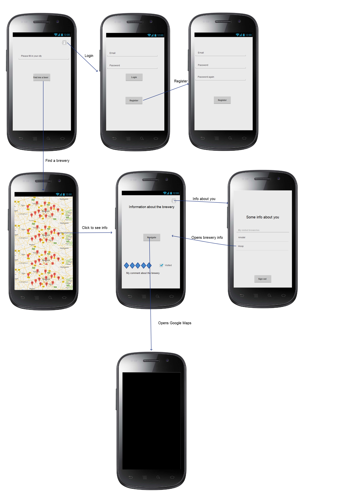

# ProgrammeerProject

## The problem
This app will solve a 'problem' that some hipsters might have. Where is the nearest brewery in town and how do I get there? 
The app provides a good amount of information about breweries that you can look up in the app. After that, you can set it as 
visited, give it a score and add a little bit of text about your experience. 

## The solution
The app will give information about nearby breweries and it will lead to you to the breweries you want to.

### Main features:
What are the apps main features?
- Look up nearby breweries or breweries around the world
- Look up breweries by typing in a city 
- Log in to set the brewery as visited and to give it a score
- Create an account to save scores, comments and visited breweries
- The app opens Google Maps so you can find your way to the brewery with ease!

### Minimum Viable Product (MVP):
- Everything that is in the main features

### Optional to implement:
- Find breweries nearby with your location

## Prerequisites

### Data sources:
- Beermapping.com API. The api gives a decent JSON and it doesn't need any tweaking (https://beermapping.com/api/)
- Google Maps API. (https://developers.google.com/maps/documentation/android-api/)

### External components:
- Firebase

### Similar apps:
- Untappd, free from the Google Play Store. 
I don't like the app. It is complicated and annoying to use. Don't know where to click. Way to comprehensive. It has a big learning curve.
The app does almost everything my app will do, but in a more complicated way. Also, this app requires you to make an account. My app won't do that. I want my app to be useful for everybody that wants to use it, even withou account. Untappd also uses a big map with markers on it to display the breweries and I want to do the same thing. So my goal is to make a fairly similar app, but better and easier to understand. 
- Miscellaneous other small apps, but they are not available in the Netherlands.

### Hardest parts:
- Getting the map with the breweries to work smoothly and scale the map the right way. I have to really understand the documentation.
- Get a good score on Better Code Hub. I should check it regularly and not only at the end!
- Not make it to simple. During the process of making the app, I should think of better and more functions, without overcomplicating the app just like Untappd.

## Visual sketch:

## Better Code Hub

