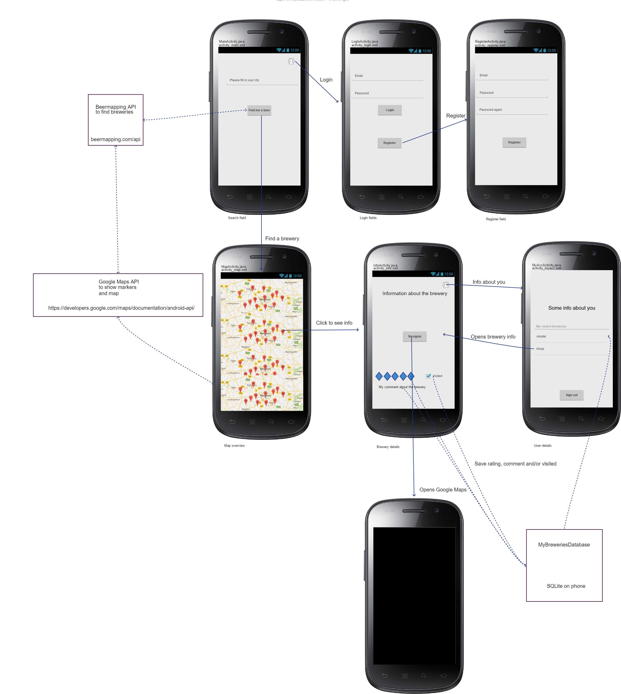
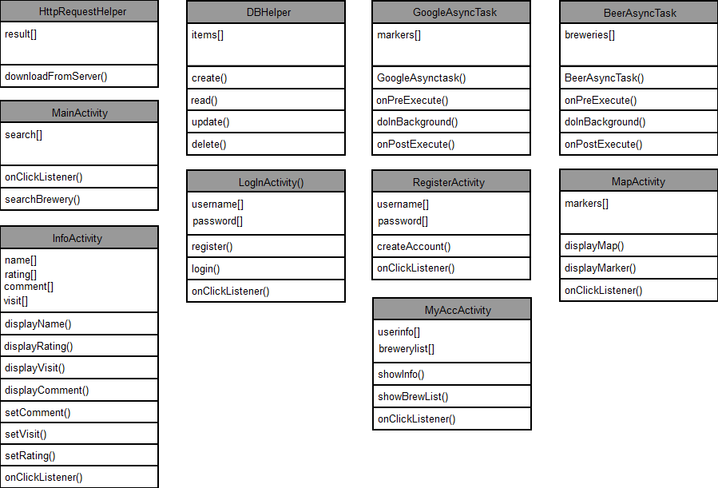

# Design Document 

## A list of APIs and plugins:
- Firebase
- SQLite
- Beermapping API
- Google Maps API

## A list of database tables:

### MyBreweryDatabase containing:
- UserId, int, primary key. 
- UserEmail, varchar (64)
- Brewery, varchar (64)
- Rating, int
- Comment, varchar (140). The comment can only be 140 characters long in order to force the user to be summarily.
- Visited, int

## Advanced sketch

## Diagram of utility modules, classes and functions

